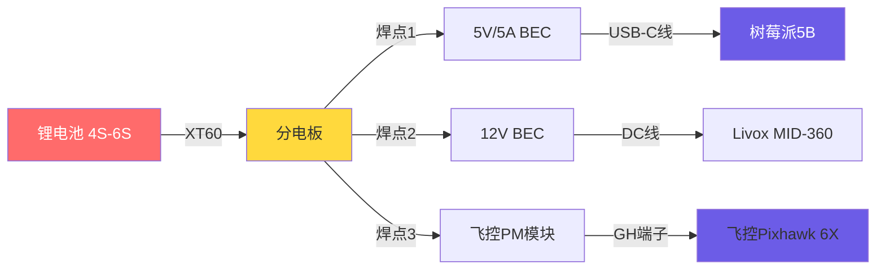

# 自研四旋翼无人机实时仿地与避障系统：完整操作流程手册

> 说明：树莓派 5 现阶段建议直接使用 Ubuntu 24.04 LTS（ARM64）+ ROS2 Jazzy。本文已按这条路线更新；如果你坚持用 Ubuntu 22.04/Humble，请改走容器或源码编译，不建议把 22.04 作为树莓派 5 的默认系统。

> 使用建议：本文默认的机载系统是树莓派 5 + Ubuntu 24.04 + ROS2 Jazzy，地面站是运行 QGroundControl 的另一台电脑。若某个 ROS2 包在 ARM64 上没有现成二进制包，优先源码编译，不要回退到 22.04 作为默认方案。

>来自搁浅的tips:此方案并非完整的，缺少部分步骤，方案都是经过我自己验证结束后进行编写修改的。因人而异，可能出现不同的问题。 

---
#树莓派临时关闭省电模式
```

sudo iw dev wlan0 set power_save off
```
永久关闭（推荐）
若临时关闭有效，按以下步骤永久禁用：

创建配置文件 sudo nano /etc/NetworkManager/conf.d/default-wifi-powersave-on.conf

输入以下内容：

```
[connection]
wifi.powersave = 2
```

## 第一部分：硬件准备与连接

### 1.1 所需工具与耗材

- 电烙铁/热风枪（用于焊接电源线）
- 万用表（测量电压，必备）
- 杜邦线套装（公母、母母各若干）
- USB转TTL模块（FTDI，用于TF03）
- 热缩管、扎带、3M双面胶
- 显示屏+键盘（首次配置树莓派用，之后可纯SSH）
- MicroSD卡读卡器
- 可调电源或已充电的飞行电池

### 1.2 物理接线步骤

**请严格按以下顺序操作，每完成一步用万用表确认后再进行下一步。**

#### 步骤1：搭建供电系统

```
电池(4S~6S) → 分电板(PDB)
分电板输出：
├── 飞控PM模块（直接插，提供飞控及舵机/电调电源）
├── 5V/5A BEC → 树莓派5B USB-C口
├── 12V/1A BEC → MID-360电源线
└── 5V/3A BEC（备用，仅D455供电不足时使用）
```


**操作**：

1. 将BEC输入线焊接到分电板的电源焊盘上（注意正负极，红正黑负）。
2. 万用表测量各BEC输出电压：5V端口应在4.9~5.2V，12V端口应在11.8~12.2V。
3. 先不接负载，确认无误后断电。

**实物接线图**：


#### 步骤2：树莓派与飞控串口连接

**关键：树莓派5B的UART0在GPIO上默认被蓝牙占用，必须先禁用蓝牙。**

树莓派5B GPIO引脚图（仅标出关键引脚）：

```
树莓派5B GPIO Header:
┌─○─○─○─○─○─○─○─○─○─○─○─○─○─○─○─○─○─○─○─┐
│ 1 2 3 4 5 6 7 8 9 ...                    20│
│○─○─○─○─○─○─○─○─○                          │
│21 22 ...                          39 40   │
│        △ Pin 8=TXD  Pin 10=RXD             │
└────────────────────────────────────────────┘
```

**接线表**：
| 树莓派GPIO           | 飞控TELEM2 | 线色建议 |
| -------------------- | ---------- | -------- |
| Pin 8 (TXD, GPIO14)  | RX         | 黄色     |
| Pin 10 (RXD, GPIO15) | TX         | 绿色     |
| Pin 6 (GND)          | GND        | 黑色     |

> **飞控TELEM2接口定义**（以Pixhawk 6X为例，GH 6pin连接器）：Pin2=TX, Pin3=RX, Pin6=GND。请查阅你的飞控具体datasheet。

**操作**：
1. 用杜邦线按上表连接。
2. 用万用表蜂鸣档确认每条线导通，无短路。
3. 暂时不插树莓派电源。

#### 步骤3：传感器连接

**RealSense D455**：
- 直接用USB-C线连接树莓派USB3.0口（蓝色）。
- 若后期调试发现D455频繁掉线，再加接5V BEC到D455的辅助供电口（背面小圆口）。

**北醒TF03-180**：
```
TF03出线定义（5芯）：
├── 红色：VCC 5V
├── 黑色：GND
├── 绿色：TXD（激光雷达发送）
├── 白色：RXD（激光雷达接收）
└── 黄色：配置线（不用接）

连接方式1：通过FTDI USB转串口模块
TF03 红 → FTDI 5V
TF03 黑 → FTDI GND
TF03 绿 → FTDI RXD  （注意：交叉连接）
TF03 白 → FTDI TXD

FTDI USB口 → 树莓派USB口
```

> **⚠️ 注意**：部分FTDI模块的I/O电平是5V，TF03是3.3V。虽然TF03有一定耐受，但长期使用建议加电平转换或购买3.3V FTDI。实际测试多数FTDI可直接使用无问题。

**Livox MID-360**：
1. 网线一端插入MID-360的RJ45口，另一端插入树莓派RJ45口。
2. 12V BEC的输出线按正负极接MID-360电源线（航空插头：Pin1=GND, Pin2=12V）。
3. 上电后MID-360的LED灯：蓝灯闪烁=初始化，绿灯常亮=正常工作，红灯=故障。

---

## 第二部分：飞控固件与基础调试

### 2.1 PX4固件烧录

1. 用USB-C线连接飞控到**地面电脑**（不是你用来写代码的电脑就是你的个人笔记本）。
2. 打开QGroundControl（如未安装，从 https://qgroundcontrol.com 下载）。
3. 飞控上电，QGC自动识别并弹出固件选择界面。
4. 选择 **PX4 Pro Stable Release v1.14.x**（或最新稳定版），点击确定。
5. 等待刷写完成，飞控自动重启。

### 2.2 机架选择与传感器校准

在QGC中按向导依次完成：

**机架选择**：
- 点击"机架"图标 → 选择 `Generic Quadcopter`（通用四旋翼）
- 点击"应用并重启"

**传感器校准**：
- 加速度计：按提示将飞控6个面朝下放置，每面保持静止直到提示成功。
- 罗盘（磁力计）：按提示沿三个轴缓慢旋转。
- 水平校准：将无人机放置在水平面上，点击校准。
- ESC校准（电调校准）：先不要装桨！按QGC提示操作，校准油门行程。

**遥控器校准**：
1. 打开遥控器，接收机对频。
2. QGC中点击"遥控器" → "校准" → 按提示摇动所有摇杆和开关。
3. 设定飞行模式开关：通道5=飞行模式(Stabilized→Position→Offboard)，通道6=返航/紧急。

### 2.3 核心参数配置

在QGC顶部菜单进入"参数"页面，使用搜索框快速定位并修改：

| 参数名称           | 修改为         | 作用                       |
| ------------------ | -------------- | -------------------------- |
| `MAV_0_CONFIG`     | `TELEM 2`      | 指定树莓派连接端口         |
| `MAV_0_MODE`       | `Normal`       | MAVLink正常模式            |
| `SER_TEL2_BAUD`    | `921600 8N1`   | 高速串口波特率             |
| `EKF2_HGT_MODE`    | `Range sensor` | 高度来源为外部测距仪       |
| `EKF2_RNG_AID_HGT` | `1`            | 启用测距仪辅助EKF          |
| `COM_ARM_WO_GPS`   | `1`            | 允许室内无GPS解锁          |
| `NAV_RCL_ACT`      | `Loiter`       | 遥控失控后悬停             |
| `MPC_ALT_MODE`     | `2`            | Range Sensor模式定高       |
| `MPC_VEL_MANUAL`   | `5`            | 手动模式最大速度(可后期调) |

修改完毕后，点击工具栏的"重启飞控"。

### 2.4 首次解锁验证（无桨）

1. **务必确认没有装螺旋桨！**
2. 给无人机上电，等待GPS/IMU初始化（QGC左上角显示"准备就绪"）。
3. 遥控器打开，油门拉到最低，模式切到Stabilized。
4. 执行解锁操作（通常是油门右下持续2秒，以你的遥控器设置为准）。
5. 观察飞控LED：解锁后常亮（PX4为蓝色常亮）。
6. 轻推油门，确认4个电机转动平稳，方向正确（按机架图纸对）。
7. 推油门到30%测试响应，推俯仰横滚看对应电机转速变化。
8. 上锁（油门左下持续2秒）。

---

## 第三部分：树莓派系统安装与配置

### 3.0 推荐执行顺序

1. 烧录 Ubuntu 24.04 到 TF 卡。
2. 首次启动并连上 SSH。
3. 先换源，再做 `apt update` 和后续安装。
4. 配置静态 IP、串口权限和系统基础工具。
5. 再进入 ROS2 Jazzy 和传感器驱动安装。

> 结论：如果你已经能 SSH 进去，建议先换源。这样后面安装 `colcon`、`mavros`、`realsense` 这些包会稳定很多，也更快。

### 3.1 烧录Ubuntu 24.04

1. 下载树莓派专用镜像：
    - 推荐直接用 Raspberry Pi Imager 选择 Ubuntu Server 24.04 LTS（64-bit）
    - 如果你习惯手动下载，请到官方 24.04 镜像目录选最新的 `ubuntu-24.04.x-preinstalled-server-arm64+raspi.img.xz`：`https://cdimage.ubuntu.com/releases/24.04/release/`
2. 使用Raspberry Pi Imager或balenaEtcher烧录到TF卡（至少64GB）。
3. **烧录后不要拔出读卡器**，需修改配置文件：

   **配置WiFi自动连接**：
   编辑TF卡`system-boot`分区下的`network-config`文件：
   ```yaml
   version: 2
   wifis:
     renderer: networkd
     wlan0:
       dhcp4: true
       optional: true
       access-points:
         "你的WiFi名":
           password: "你的WiFi密码"
   ```

4. **禁用蓝牙以释放UART0**：
   编辑`system-boot`分区下的`config.txt`，在末尾添加：
   ```
   dtoverlay=disable-bt
   enable_uart=1
   ```

5. 弹出TF卡，插入树莓派，上电启动。

### 3.2 首次SSH连接

1. 树莓派上电约2~3分钟后，从路由器后台或使用网络扫描工具找到树莓派的IP地址。
2. 从你的个人电脑SSH连接：
   ```bash
   ssh ubuntu@树莓派IP地址
   # 默认密码: ubuntu
   # 首次登录会强制要求修改密码
   ```
3. 设置新密码后，会要求再次登录。成功进入命令行即表示系统正常。

### 3.2.1 先换源（建议现在就做）

如果你现在已经登录到树莓派，建议先把 Ubuntu 的软件源换成国内镜像，再继续后面的安装。这样后面执行 `apt update`、安装 ROS2 依赖、编译包时会更稳。

最省事的方式是直接在后面的 ROS2 安装阶段用鱼香 ROS 脚本统一换源；如果你想在系统阶段就先处理，也可以直接手工改 Ubuntu 源。两种方式任选其一即可，不需要重复做两次。

**方式A：继续用后面的鱼香 ROS 脚本统一换源**

优点是简单，适合不想手动改系统配置的情况。你只需要先完成这一章的网络和 SSH 配置，然后到第四部分直接执行鱼香脚本里的“换系统源”。

**方式B：现在就手工换源**

1. 先备份源配置：
    ```bash
    sudo cp /etc/apt/sources.list /etc/apt/sources.list.bak 2>/dev/null || true
    sudo cp /etc/apt/sources.list.d/ubuntu.sources /etc/apt/sources.list.d/ubuntu.sources.bak 2>/dev/null || true
    ```
2. 打开源配置文件：
    ```bash
    sudo vim /etc/apt/sources.list.d/ubuntu.sources
    ```
3. 将 `URIs:` 改成你常用的国内镜像，例如清华、阿里云或中科大镜像。
4. 保存后执行：
    ```bash
    sudo apt update
    ```
5. 如果没有报错，说明换源成功。

下面给出两套可直接复制粘贴的脚本（任选其一），会把系统源替换为清华或阿里云镜像，适用于 Ubuntu 24.04（脚本会自动使用当前系统的发行代号）。执行前请确保已备份并理解每一步。

A. 使用清华镜像：

```bash
# 取当前系统代号，例如 24.04 的代号
CODENAME=$(lsb_release -sc)

# 备份现有源
sudo cp /etc/apt/sources.list /etc/apt/sources.list.bak

sudo tee /etc/apt/sources.list > /dev/null <<EOF
deb https://mirrors.tuna.tsinghua.edu.cn/ubuntu/ ${CODENAME} main restricted universe multiverse
deb https://mirrors.tuna.tsinghua.edu.cn/ubuntu/ ${CODENAME}-security main restricted universe multiverse
deb https://mirrors.tuna.tsinghua.edu.cn/ubuntu/ ${CODENAME}-updates main restricted universe multiverse
deb https://mirrors.tuna.tsinghua.edu.cn/ubuntu/ ${CODENAME}-backports main restricted universe multiverse
deb-src https://mirrors.tuna.tsinghua.edu.cn/ubuntu/ ${CODENAME} main restricted universe multiverse
EOF

# 更新索引
sudo apt update
```

B. 使用阿里云镜像：

```bash
CODENAME=$(lsb_release -sc)
sudo cp /etc/apt/sources.list /etc/apt/sources.list.bak

sudo tee /etc/apt/sources.list > /dev/null <<EOF
deb http://mirrors.aliyun.com/ubuntu/ ${CODENAME} main restricted universe multiverse
deb http://mirrors.aliyun.com/ubuntu/ ${CODENAME}-security main restricted universe multiverse
deb http://mirrors.aliyun.com/ubuntu/ ${CODENAME}-updates main restricted universe multiverse
deb http://mirrors.aliyun.com/ubuntu/ ${CODENAME}-backports main restricted universe multiverse
deb-src http://mirrors.aliyun.com/ubuntu/ ${CODENAME} main restricted universe multiverse
EOF

sudo apt update
```

验证方法：

```bash
# 检查是否能正常更新并获取包列表
sudo apt update && sudo apt upgrade -y

# 检查某个常用包是否可用（示例）
apt policy python3-pip
```

回滚到备份源（如需）：

```bash
sudo cp /etc/apt/sources.list.bak /etc/apt/sources.list
sudo apt update
```

### 3.3 基础环境配置

```bash
# 更新系统（建议先完成换源，再执行这一步）
sudo apt update && sudo apt upgrade -y

# 安装基础工具
sudo apt install -y net-tools vim git curl wget htop i2c-tools

# 设置时区
sudo timedatectl set-timezone Asia/Shanghai

# 设置hostname（可选，方便识别）
sudo hostnamectl set-hostname drone-pi

# 确认UART0设备存在
ls -la /dev/ttyAMA0
# 应该看到类似: crw-rw---- 1 root dialout 204, 64 ... /dev/ttyAMA0

# 将用户加入dialout组（避免每次用sudo）
sudo usermod -a -G dialout $USER
# 需要退出SSH重新登录才生效
```

### 3.4 配置以太网静态IP（连接MID-360）

MID-360出厂IP为`192.168.1.100`，需将树莓派以太口配成同网段。

如果你打算让树莓派同时连 WiFi 上网和有线口接 MID-360，这是推荐做法。WiFi 保持默认 DHCP，有线口单独固定到 `192.168.1.5/24`，不要给 `eth0` 配网关。

```bash
# 先查看系统里实际存在的 netplan 文件名
ls -la /etc/netplan/

# 常见文件名可能是 50-cloud-init.yaml、01-netcfg.yaml 或 00-installer-config.yaml
# 编辑你实际看到的那个文件
sudo vim /etc/netplan/50-cloud-init.yaml
```

修改为：
```yaml
network:
  version: 2
  ethernets:
    eth0:
      dhcp4: no
      addresses:
        - 192.168.1.5/24
      # 注意不要设gateway，避免影响wifi上网的路由
```

应用配置：
```bash
sudo netplan apply
```

验证：
```bash
ip addr show eth0
# 确认IP为192.168.1.5
```

---

## 第四部分：ROS2 Jazzy安装（鱼香ROS一键脚本）

> 建议：如果你的树莓派 5 跑的是 Ubuntu Server，优先安装 ROS2 Base/Server 版，而不是 Desktop 版。这样更省内存、更适合长期跑 MAVROS、传感器驱动和融合节点。只有当你需要在树莓派本机直接使用 RViz、rqt 或其他图形工具时，再额外安装桌面组件。

### 4.1 下载并运行一键安装脚本

```bash
# 下载脚本
wget http://fishros.com/install -O fishros && chmod +x fishros

# 运行
./fishros
```

你会看到如下菜单（大致）：
```
[1] 一键安装:ROS
[2] 一键安装:ROS2
[3] 一键配置:rosdep
[4] 一键配置:ROS环境
[5] 一键配置:系统源
[6] 一键安装:VsCode
[7] 一键安装:Docker
[0] 退出
```

### 4.2 按顺序执行以下步骤

**第一步：换系统源**
```
输入 5 回车
→ 选择 [1] 更换系统源并更新
→ 等待完成
```

**第二步：安装ROS2 Jazzy**
```
输入 1 回车
→ 是否更换系统源？选择 [2] 不更换（已换过）
→ 选择ROS版本: [1] jazzy(ROS2)
→ 安装类型: 优先选择 [2] Server/Base 版（更适合 Ubuntu Server）
→ 如果你明确需要本机图形界面，再选 Desktop 版
→ 等待5~10分钟，看到安装成功提示
```

**第三步：按需补装桌面组件（可选）**
如果后面确实需要在树莓派本机直接运行 RViz、rqt 等 GUI 工具，可以在 ROS2 Base 安装完成后再补装桌面相关包，而不必一开始就装整套 Desktop。

```bash
sudo apt install -y ros-jazzy-rviz2 ros-jazzy-rqt ros-jazzy-rqt-common-plugins
```

**第四步：配置rosdepc**
```
输入 3 回车
→ 等待配置完成（解决国内rosdep init失败问题）
```

**第五步：配置ROS环境**
```
输入 4 回车
→ 自动添加source命令到.bashrc
→ 配置ROS2命令行自动补全
```

**第六步：验证安装**
```bash
# 新开一个SSH窗口，或重新source
source ~/.bashrc

# 测试ROS2环境
echo $ROS_DISTRO
# 应输出: jazzy

# 如果你装的是 Base/Server 版，这里也可能只需要验证核心功能
ros2 node list

ros2 doctor --report

# 运行talker/listener测试（注意：Server/Base 版可能没有 demo 节点）
# 若报错请参照下面说明安装 demo 节点
# ros2 run demo_nodes_cpp talker &
# ros2 run demo_nodes_py listener
```

> 注：如果你选择安装的是 `Server`/`Base` 版，系统默认只安装 ROS2 的核心运行库和必要组件，示例/演示节点（例如 `demo_nodes_cpp` / `demo_nodes_py` 提供的 `talker` / `listener`）**通常不会包含在内**。因此，上面的 `ros2 run demo_nodes_*` 命令在某些环境下可能会报错（找不到可执行文件）。

1. 检查是否已安装 demo 节点：

```bash
ros2 pkg list | grep demo || true
```

2. 若未安装且你希望运行示例进行功能验证，可手动安装：

```bash
sudo apt update
sudo apt install -y ros-jazzy-demo-nodes-cpp ros-jazzy-demo-nodes-py

# 然后在新终端或重新source后运行验证
source /opt/ros/jazzy/setup.bash
ros2 run demo_nodes_cpp talker &
ros2 run demo_nodes_py listener
```

3. 如果你需要在树莓派本机使用图形工具（例如 `rviz2`、`rqt`），建议仍然以 `Server/Base` 作为默认安装，按需补装桌面包：

```bash
sudo apt install -y ros-jazzy-rviz2 ros-jazzy-rqt ros-jazzy-rqt-common-plugins
```

这样能在节省资源的前提下，根据需要补充演示或 GUI 功能。

### 4.3 安装编译工具与创建工作空间

> 如果你前面已经通过鱼香完成了第2、3、4、5步，这里不需要再重复安装 `python3-rosdep2` / `python3-rosdep`，只保留编译和工作空间相关工具即可。

```bash
# 安装colcon和依赖
sudo apt install -y python3-colcon-common-extensions build-essential cmake

# 创建工作空间
mkdir -p ~/drone_ws/src
cd ~/drone_ws
colcon build
# 首次build会看到警告，正常（还没有包）

# 将工作空间也加入.bashrc
echo "source ~/drone_ws/install/setup.bash" >> ~/.bashrc
source ~/.bashrc
```

---

## 第五部分：MAVLink通信搭建

### 5.1 安装MAVROS及相关工具

> 说明：下面两种方式**二选一**，不要同时启用。
> - 方式A = MAVROS 直接连飞控，适合后续要做 ROS2 控制与话题融合的场景。
> - 方式B = mavlink-router 转发给 QGC，适合先单独验证飞控与地面站联通。
> - 如果你最终要跑本文后面的 ROS2 融合与 Offboard，优先选方式A。

如果你只想按最短路径执行：

- 方式A：只看 5.1A、5.2A、5.3A
- 方式B：只看 5.1B、5.2B、5.3B
- 两种方式不要同时启用同一个串口

| 方式 | 对应方案 | 典型用途 | 本文后续章节 |
| --- | --- | --- | --- |
| 方式A | MAVROS 直接连接飞控 | ROS2 话题、控制、Offboard | 5.2A、5.3A、后续第七到第十部分 |
| 方式B | mavlink-router 转发给 QGC | 先验证飞控与地面站联通 | 5.3B、5.4 |

#### 5.1A 方式A：安装 MAVROS

```bash
# 安装 MAVROS
sudo apt install -y ros-jazzy-mavros ros-jazzy-mavros-extras

# 安装地理库（MAVROS 依赖）
cd ~
wget https://raw.githubusercontent.com/mavlink/mavros/master/mavros/scripts/install_geographiclib_datasets.sh
sudo bash install_geographiclib_datasets.sh
```

> 方式B 的完整内容放在本节后半部分，先把方式A讲完。

### 5.2A 方式A：MAVROS 直连飞控

这里有两种连接方式，推荐先用 USB 方式打通链路：

- 方式1（推荐，实测稳定）：树莓派 5 USB 蓝口 -> 飞控 USB-C，设备通常是 `/dev/ttyACM0`
- 方式2（可选）：飞控 TELEM2 -> 树莓派 GPIO UART，设备通常是 `/dev/ttyAMA0`

你这次实测已经验证：USB 方式可稳定工作，并可同时转发到 QGC 与 MAVROS。

#### 5.2A.1 先判断当前设备节点

```bash
ls -l /dev/ttyACM* /dev/ttyUSB* /dev/ttyAMA* 2>/dev/null || true
```

判定规则：
- 出现 `/dev/ttyACM0`：说明飞控通过 USB CDC-ACM 连入（你当前就是这种）
- 出现 `/dev/ttyAMA0`：说明在用树莓派 GPIO UART
- 两者都在时，优先用你实际接线对应的那一个，不要混用

#### 5.2A.2 GPIO UART 接线参考（仅方式2需要）

**推荐接线方式**：

| 飞控 TELEM2 | 树莓派 5 GPIO | 说明 |
| --- | --- | --- |
| TX | Pin 10 / GPIO15 / RXD | 飞控发数据到树莓派 |
| RX | Pin 8 / GPIO14 / TXD | 树莓派发数据到飞控 |
| GND | Pin 6 / GND | 必须共地 |

**接线注意事项**：
- 先断电再接线，避免短路。
- TX 和 RX 一定要交叉接，不要同名对接。
- GPIO 方式下，树莓派 5 优先使用 `/dev/ttyAMA0`。

#### 5.2A.3 直接测试 MAVROS（方式1 与 方式2 各选一条）

确保飞控已上电，串口线已连接好：

```bash
# 先查看串口是否存在
ls -la /dev/ttyACM0 /dev/ttyAMA0 /dev/ttyAMA10 2>/dev/null || true

# 方式1：USB-ACM（推荐）
ros2 run mavros mavros_node --ros-args -p fcu_url:=serial:///dev/ttyACM0:115200

# 方式2：GPIO UART
ros2 launch mavros px4.launch.py fcu_url:=/dev/ttyAMA0:921600
```

如果一切正常，应该看到MAVROS节点启动后输出：
```
[INFO] [mavros]: FCU: connected!
```

**打开新SSH窗口**验证话题：
```bash
source ~/drone_ws/install/setup.bash

# 查看飞控状态
ros2 topic echo /mavros/state
# 应看到: connected: True, armed: False

# 查看IMU数据
ros2 topic hz /mavros/imu/data
# 典型可见约50Hz（因机型与配置不同会有差异）
```
以下表格更直观且紧凑地说明这两条命令的关键输出字段、含义与快速判断：


下面把信息拆成两个简短表格，并提供典型输出示例（独立代码块），以便在不同渲染器中也易读：

**/mavros/state（链路与模式）**

| 字段 | 含义 | 快速判断 |
| --- | --- | --- |
| `connected` | MAVROS 与飞控的 MAVLink 连接是否建立 | `True` = 链路正常；`False` = 检查串口/占用/波特率 |
| `armed` | 飞控是否解锁（允许电机输出） | `True` = 已解锁（测试时请无桨）；`False` = 未解锁（安全） |
| `mode` | 当前飞行模式（固件语义） | 例如 `POSCTL`、`OFFBOARD`；`OFFBOARD` 表示外部控制 |
| `system_status` | MAVLink HEARTBEAT 报告的状态码 | 数值码需对照 MAVLink 文档解读（STANDBY/ACTIVE 等） |

**/mavros/imu/data（IMU 频率与内容）**

| 项目 | 含义 | 快速判断 |
| --- | --- | --- |
| `average` / `min` / `max` / `std dev` | IMU 发布频率统计（Hz） | `average`≈目标频率且 `std dev` 小 → 稳定；否则检查串口/CPU/占用进程 |
| `linear_acceleration` | 线加速度（m/s^2） | 应为合理非零值；全 0 或 NaN 表示异常 |
| `angular_velocity` | 角速度（rad/s） | 应有小幅波动与重力分量相关值 |
| `orientation` | 四元数表示的姿态 | 数值应规范（非 NaN，四元数模约等于1） |

**典型输出示例（来自现场）**：

```yaml
# /mavros/state（原样复制自现场）
---
header:
    stamp:
        sec: 1779953382
        nanosec: 511928318
    frame_id: ''
connected: true
armed: false
guided: true
manual_input: false
mode: AUTO.LOITER
system_status: 0
---
```

```text
# /mavros/imu/data 频率统计（ros2 topic hz 输出）
average rate: 50.000
	min: 0.016s max: 0.024s std dev: 0.00144s window: 10000
```

**现场输出逐项解释**：

- `header.stamp`：消息时间戳，`sec` 与 `nanosec` 表示自 UNIX 纪元（1970-01-01）以来的秒与纳秒，或 ROS 时间（若启用了 /use_sim_time 则为仿真时间）。用于比对数据时序和延迟分析。
- `frame_id`：消息所用的参考坐标系标识符（本条为空字符串，表示未指定或使用默认坐标系）。
- `connected`：MAVROS 与飞控的 MAVLink 链路是否已建立。`true` 表示收到了心跳并能正常通信。
- `armed`：飞控是否已解锁，`true` 表示允许电机驱动输出（现场为 `false`，处于安全状态）。
- `guided`：飞控是否处于“guided/外部引导”允许的状态（可接受外部控制命令）。`true` 表示允许外部控制路径/命令。
- `manual_input`：是否检测到 RC/手动输入（`false` 表示当前没有手动遥控输入生效）。
- `mode`：飞控当前工作模式，示例 `AUTO.LOITER` 表示处于自动悬停/定点模式（由飞控自动控制位置）。在不同固件下字符串格式不同，含义以固件文档为准。
- `system_status`：来自 MAVLink HEARTBEAT 的系统状态码（整数），其常见含义（MAVLink `MAV_STATE`）：

    - `0` = UNINIT（未初始化）
    - `1` = BOOT（引导）
    - `2` = CALIBRATING（校准中）
    - `3` = STANDBY（待命）
    - `4` = ACTIVE（正常运行）
    - `5` = CRITICAL（关键状态）
    - `6` = EMERGENCY（紧急）
    - `7` = POWEROFF（关机）
    - `8` = FLIGHT_TERMINATION（航行终止）

    你现场 `system_status: 0` 表示飞控当前处在未初始化/或未填充该字段的语义（不同固件/版本对该字段的填充策略不同，若其它参数正常且能读到 IMU，通常不影响链路本身）。

**关于 IMU `ros2 topic hz` 输出的解释（现场样例）**：

- `average rate: 50.000`：平均发布频率约 50 Hz（即每条消息约 0.02 s）。
- `min: 0.016s max: 0.024s`：观测到的最短与最长消息间隔（以秒为单位）。将其换算为频率范围：

    - 最短间隔 0.016 s → 1 / 0.016 ≈ 62.5 Hz（瞬时最高频率）
    - 最长间隔 0.024 s → 1 / 0.024 ≈ 41.7 Hz（瞬时最低频率）

- `std dev: 0.00144s`：消息间隔的标准差（约 1.44 ms），越小表示周期越稳定。示例中 `std dev` 约 1.44ms，结合平均 20ms（50Hz）可认为发布稳定但存在少量抖动。

快速判断与建议：

- 如果 `average` 接近预期（50Hz）且 `std dev` 很小（例如 < 0.005s），IMU 数据可认为稳定。现场样例符合该条件。
- 若 `min` 显著小于平均且 `max` 显著大于平均（导致频率波动大），排查顺序：串口波特率是否正确、是否有进程占用串口（`sudo lsof /dev/tty*`）、系统负载（`top`）或磁盘/IO 持续占用。
- 若 `system_status` 非常规（例如 `5/6`），优先检查飞控日志与硬件状态，避免在异常状态下飞行。

我会把这些逐项解释保留在 `5.2A.3` 下的“典型输出示例”后，方便现场对照诊断。
**快速排查（可复制执行）**：

```bash
sudo lsof /dev/ttyACM0        # 端口是否被占用
ps aux | grep -E "mavlink-router|mavros"  # 查找占用进程
ros2 topic hz /mavros/imu/data  # 查看IMU频率
top -bn1 | head -n5            # 查看系统负载
sudo tcpdump -i lo -n udp and port 14540 -c 50  # 抓本机UDP数据（如有）
```

按`Ctrl+C`停止，先不永久启动。

### 5.3A 方式A：创建 MAVROS Launch 文件（供后续集成）

> 说明：这里使用 MAVROS 官方 `px4.launch` 的加载方式，和你在树莓派上实测通过的配置保持一致。这样可以避免手写参数时出现 `mavros/status` 订阅冲突之类的问题。

创建工作空间包：
```bash
cd ~/drone_ws/src
ros2 pkg create fcu_bridge --build-type ament_python --dependencies rclpy launch launch_ros mavros
cd fcu_bridge
mkdir launch
```

创建 `launch/fcu.launch.py`：
```python
from launch.actions import DeclareLaunchArgument
from launch import LaunchDescription
from launch_ros.actions import Node
from launch_ros.substitutions import FindPackageShare
from launch.substitutions import LaunchConfiguration, PathJoinSubstitution


def generate_launch_description():
    pluginlists_yaml = PathJoinSubstitution([
        FindPackageShare('mavros'), 'launch', 'px4_pluginlists.yaml'
    ])
    config_yaml = PathJoinSubstitution([
        FindPackageShare('mavros'), 'launch', 'px4_config.yaml'
    ])

    return LaunchDescription([
        DeclareLaunchArgument('fcu_url', default_value='serial:///dev/ttyACM0:115200'),
        DeclareLaunchArgument('gcs_url', default_value=''),
        DeclareLaunchArgument('tgt_system', default_value='1'),
        DeclareLaunchArgument('tgt_component', default_value='1'),
        DeclareLaunchArgument('fcu_protocol', default_value='v2.0'),
        Node(
            package='mavros',
            executable='mavros_node',
            namespace='mavros',
            output='screen',
            parameters=[
                {
                    'fcu_url': LaunchConfiguration('fcu_url'),
                    'gcs_url': LaunchConfiguration('gcs_url'),
                    'tgt_system': LaunchConfiguration('tgt_system'),
                    'tgt_component': LaunchConfiguration('tgt_component'),
                    'fcu_protocol': LaunchConfiguration('fcu_protocol'),
                },
                pluginlists_yaml,
                config_yaml,
            ],
        )
    ])
```

编译：
```bash
cd ~/drone_ws
colcon build --packages-select fcu_bridge --symlink-install
source install/setup.bash
```

**补充说明**：如果你后面还想把地面站流量转发到 QGC，可以在启动时显式传入 `gcs_url:=udp://@:14550`；如果只是先验证飞控连通，保持默认空值也可以。

> **注意**：后面我们会用总 Launch 启动 MAVROS，因此**先不要让 mavlink-router 自动启动**（否则占用串口导致 mavros 无法连接）。如果你的 mavlink-router 已设开机启动，先停掉：`sudo systemctl stop mavlink-router; sudo systemctl disable mavlink-router`。

**启动 MAVROS 并验证闭环**：

```bash
# 启动 MAVROS（可按需加 gcs_url:=udp://@:14550）
ros2 launch fcu_bridge fcu.launch.py
```

启动后，新开一个终端，执行：

```bash
source ~/drone_ws/install/setup.bash

# 查看飞控状态，重点看 connected 是否为 true
ros2 topic echo /mavros/state

# 查看IMU频率，重点看是否持续输出、平均频率是否接近预期
ros2 topic hz /mavros/imu/data
```

通过标准：

- `/mavros/state` 里 `connected: true`
- `/mavros/imu/data` 持续有数据，平均频率稳定（例如接近 50Hz）

如果这里已经正常，说明 5.3A 的“创建 -> 编译 -> 启动 -> 验证”闭环完成，可以继续后面的 5.4 QGC 连接验证或第六部分传感器驱动安装。

### 5.1B 方式B：安装 mavlink-router

如果你现在的目标只是先让 QGC 收到飞控遥测，而不是先做 ROS2 控制，那么就看这一条路线。方式B 只负责“飞控 -> 树莓派 -> QGC”，不负责 MAVROS 话题。

```bash
# 安装 mavlink-router（用于转发 MAVLink 到 QGC）
# 注意：Ubuntu 24.04 的仓库里经常找不到该包，若 apt 安装失败，请按 5.2B 源码编译安装
sudo apt install -y mavlink-router || true
```

#### 5.2B 方式B：mavlink-router 源码编译安装

如果 `apt install` 提示找不到包，直接按下面步骤从源码编译安装。树莓派 5 上这条路径是推荐方案之一。

```bash
# 安装编译依赖
sudo apt update
sudo apt install -y git meson ninja-build pkg-config gcc g++ systemd libglib2.0-dev libsystemd-dev libdbus-1-dev

# 拉取源码
cd ~
git clone https://github.com/mavlink-router/mavlink-router.git
cd mavlink-router

# 拉取子模块（mavlink C library）
git submodule update --init --recursive

# 配置编译目录
meson setup build .

# 编译
ninja -C build

# 安装到系统
sudo ninja -C build install

# 如需让 systemd 立即识别新安装的服务文件
sudo systemctl daemon-reload

# 验证安装
mavlink-routerd -V
```

安装后建议再做一次最小验证：

```bash
# 先确认配置文件目录存在（后面 5.3B 会用）
sudo mkdir -p /etc/mavlink-router

# 先试运行帮助/版本信息
mavlink-routerd -h

# 如果你是“树莓派USB口 -> 飞控USB-C”（本手册实测场景），先用 /dev/ttyACM0
sudo mavlink-routerd -v /dev/ttyACM0:115200 -e 192.168.137.1:14550

# 如果你是GPIO UART接TELEM2，再用 /dev/ttyAMA0
sudo mavlink-routerd -v /dev/ttyAMA0:921600 -e 192.168.137.1:14550
```

### 5.3B 方式B：配置与联调（转发给 QGC）

> 仅在你选择“方式B：mavlink-router”时使用这一节。若已经在 5.2A 里启动了 MAVROS，这里就不要再启动 mavlink-router。

```bash
# 创建配置文件
sudo mkdir -p /etc/mavlink-router
sudo vim /etc/mavlink-router/main.conf
```

写入以下内容（`你的电脑IP`替换为实际运行QGC的电脑IP）：
```conf
[UartEndpoint to_fcu]
Device = /dev/ttyACM0
Baud = 115200

[UdpEndpoint to_qgc]
Mode = Normal
Address = 192.168.137.1
Port = 14550
```

如果你走 GPIO UART 方式，把上面改为：

```conf
[UartEndpoint to_fcu]
Device = /dev/ttyAMA0
Baud = 921600
```

**如何获取你的电脑IP**：
- Windows: 打开cmd，输入 `ipconfig`，找到热点网卡的IPv4地址；如果你使用的是 Windows 热点，通常就是 `192.168.137.1`
- macOS: `ifconfig en0`
- Linux: `ip addr show wlan0`

配置完成后启动服务：
```bash
# 先停止之前可能运行的mavros（不然端口被占用）
sudo pkill -f mavros

# 启动mavlink-router
sudo systemctl restart mavlink-router
sudo systemctl enable mavlink-router  # 设置开机自启

# 查看状态
sudo systemctl status mavlink-router
```

#### 5.3B.1 已验证的联调命令（QGC + MAVROS 同时在线）

先在终端A运行（注意 `-e` 必须写，否则会被当成本地绑定地址导致报错）：

```bash
sudo mavlink-routerd -v /dev/ttyACM0:115200 -e 192.168.137.1:14550 -e 127.0.0.1:14540
```

再在终端B运行 MAVROS：

```bash
source /opt/ros/jazzy/setup.bash
ros2 run mavros mavros_node --ros-args -p fcu_url:=udp://:14540@127.0.0.1:14557
```

最后在终端C验证：

```bash
ros2 topic echo /mavros/state --once
ros2 topic hz /mavros/imu/data
```

通过标准：
- `/mavros/state` 里 `connected: true`
- `/mavros/imu/data` 有稳定频率（例如约 50Hz）

如需抓包确认本机回环口流量：

```bash
sudo tcpdump -i lo -n udp and port 14540 -c 10
```

### 5.4 QGC连接验证

1. 打开QGroundControl。
2. 点击左上角QGC图标 → "应用设置" → "通讯连接"。
3. 点击"添加" → 选择"UDP" → 端口: `14550` → IP地址: `192.168.137.1`（如果你用的是 Windows 热点）。
4. 点击确定，应该看到QGC界面顶部显示"已连接"并出现飞控参数。

> **注意**：此时飞控和QGC的连接是：`飞控 → 串口 → 树莓派(mavlink-router) → WiFi/UDP → 你的电脑(QGC)`。如果你用的是 Windows 热点，树莓派把数据发给热点主机 `192.168.137.1:14550` 即可。

> 如果你改用 MAVROS 方案，则这里的 QGC 通信通常由 MAVROS 的 `gcs_url` 负责，而不是 mavlink-router。

---

## 第六部分：传感器驱动安装与测试

### 6.1 RealSense D455驱动

```bash
# 安装librealsense（ARM64需从源码编译）
cd ~
sudo apt install -y libssl-dev libusb-1.0-0-dev pkg-config libgtk-3-dev libglfw3-dev libgl1-mesa-dev libglu1-mesa-dev
git clone https://github.com/IntelRealSense/librealsense.git
cd librealsense
mkdir build && cd build
cmake .. -DCMAKE_BUILD_TYPE=Release -DFORCE_RSUSB_BACKEND=false -DBUILD_EXAMPLES=false
make -j2  # 树莓派建议用-j2，避免内存不足
sudo make install

# 安装ROS2 wrapper
sudo apt install -y ros-jazzy-realsense2-camera

# 测试：启动相机
ros2 launch realsense2_camera rs_launch.py \
    depth_module.profile:=640x480x15 \
    enable_color:=false \
    enable_gyro:=false \
    enable_accel:=false
```

新终端验证：
```bash
ros2 topic echo /camera/camera/depth/image_rect_raw --once
# 应看到数据输出
```

### 6.2 北醒TF03驱动

创建ROS2包：
```bash
cd ~/drone_ws/src
ros2 pkg create tf03_driver --build-type ament_python --dependencies rclpy std_msgs sensor_msgs
cd tf03_driver
mkdir -p tf03_driver
```

创建 `tf03_driver/tf03_node.py`（完整驱动代码）：

```python
#!/usr/bin/env python3
import serial
import rclpy
from rclpy.node import Node
from sensor_msgs.msg import Range

class TF03Driver(Node):
    def __init__(self):
        super().__init__('tf03_driver')
        
        # 声明参数
        self.declare_parameter('port', '/dev/ttyUSB0')
        self.declare_parameter('baud', 115200)
        
        port = self.get_parameter('port').value
        baud = self.get_parameter('baud').value
        
        # 发布者
        self.pub = self.create_publisher(Range, '~/range', 10)
        
        # 打开串口
        try:
            self.ser = serial.Serial(port, baud, timeout=0.1)
            self.get_logger().info(f'TF03 opened on {port}')
        except serial.SerialException as e:
            self.get_logger().error(f'Failed to open {port}: {e}')
            self.ser = None
        
        # 定时读取 (50Hz)
        self.timer = self.create_timer(0.02, self.read_and_publish)

    def read_and_publish(self):
        if self.ser is None or not self.ser.is_open:
            return
        
        try:
            if self.ser.in_waiting >= 9:
                data = self.ser.read(9)
                # TF03协议: 帧头 0x59 0x59, DistL, DistH, ...
                if data[0] == 0x59 and data[1] == 0x59:
                    dist_cm = data[2] | (data[3] << 8)  # 距离，单位cm
                    
                    msg = Range()
                    msg.header.stamp = self.get_clock().now().to_msg()
                    msg.header.frame_id = 'tf03_link'
                    msg.radiation_type = Range.INFRARED
                    msg.field_of_view = 0.05
                    msg.min_range = 0.1
                    msg.max_range = 180.0
                    msg.range = dist_cm / 100.0  # 转换为米
                    
                    self.pub.publish(msg)
                self.ser.reset_input_buffer()
        except Exception as e:
            self.get_logger().error(f'Read error: {e}', throttle_duration_sec=5)

def main(args=None):
    rclpy.init(args=args)
    node = TF03Driver()
    try:
        rclpy.spin(node)
    except KeyboardInterrupt:
        pass
    finally:
        node.destroy_node()
        rclpy.shutdown()

if __name__ == '__main__':
    main()
```

修改 `setup.py`，在 `entry_points` 中添加：
```python
entry_points={
    'console_scripts': [
        'tf03_node = tf03_driver.tf03_node:main',
    ],
},
```

编译并测试：
```bash
cd ~/drone_ws
colcon build --packages-select tf03_driver --symlink-install
source install/setup.bash

# 插入FTDI USB模块，检查设备名
ls /dev/ttyUSB*

# 如果有udev规则可以固定名称，临时用：
ros2 run tf03_driver tf03_node --ros-args -p port:=/dev/ttyUSB0
```

### 6.3 Livox MID-360驱动

```bash
# 安装依赖
sudo apt install -y cmake build-essential

# 编译Livox-SDK2
cd ~
git clone https://github.com/Livox-SDK/Livox-SDK2.git
cd Livox-SDK2
mkdir build && cd build
cmake .. && make -j2
sudo make install

# 下载ROS2驱动
cd ~/drone_ws/src
git clone https://github.com/Livox-SDK/livox_ros_driver2.git
cd ..
rosdepc install --from-paths src/livox_ros_driver2 --ignore-src -r -y
colcon build --packages-select livox_ros_driver2 --symlink-install
source install/setup.bash
```

修改配置文件：
```bash
vim ~/drone_ws/src/livox_ros_driver2/config/MID360_config.json
```

找到并修改以下参数：
```json
{
  "lidar_configs": [
    {
      "lidar_type": "MID360",
      "lidar_ip": "192.168.1.100",
      "host_ip": "192.168.1.5",
      "multi_topic": 0,
      "publish_freq": 5.0,
      "pcl_data_type": 1,
      "pattern_mode": 0,
      "dual_emit_enable": false
    }
  ]
}
```

> **重要**：`publish_freq` 设为 5.0 降低树莓派负载。

测试：
```bash
# 确保MID-360已上电（12V），网线连接，绿灯亮
ros2 launch livox_ros_driver2 msg_MID360_launch.py

# 新终端验证
ros2 topic echo /livox/lidar --once
# 应看到点云数据
```

---

## 第七部分：多传感器仿地融合实现

### 7.1 创建融合包

```bash
cd ~/drone_ws/src
ros2 pkg create terrain_fusion --build-type ament_python --dependencies rclpy std_msgs sensor_msgs cv_bridge python3-numpy
cd terrain_fusion
mkdir -p terrain_fusion
```

### 7.2 融合节点完整代码

创建 `terrain_fusion/fusion_node.py`：

```python
#!/usr/bin/env python3
import cv2
import numpy as np
import rclpy
from rclpy.node import Node
from sensor_msgs.msg import Image, Range, Imu
from cv_bridge import CvBridge
from tf_transformations import euler_from_quaternion

class SimpleKalman1D:
    """一维卡尔曼滤波器"""
    def __init__(self, q=0.001, r=0.1):
        self.x = 1.0      # 状态估计值（高度，米）
        self.P = 1.0      # 估计协方差
        self.Q = q        # 过程噪声协方差
        self.R = r        # 测量噪声协方差（可动态调整）

    def update(self, z):
        """输入测量值z，返回滤波后的估计值"""
        # 预测步骤
        self.P = self.P + self.Q
        
        # 更新步骤
        K = self.P / (self.P + self.R)  # 卡尔曼增益
        self.x = self.x + K * (z - self.x)
        self.P = (1 - K) * self.P
        
        return self.x


class TerrainFusionNode(Node):
    def __init__(self):
        super().__init__('terrain_fusion_node')
        
        # 订阅话题
        self.depth_sub = self.create_subscription(
            Image, '/camera/camera/depth/image_rect_raw', self.depth_callback, 10)
        self.tf03_sub = self.create_subscription(
            Range, '/tf03/range', self.tf03_callback, 10)
        self.imu_sub = self.create_subscription(
            Imu, '/mavros/imu/data', self.imu_callback, 10)
        
        # 发布融合高度
        self.height_pub = self.create_publisher(Range, '/est_height', 10)
        
        # 工具
        self.bridge = CvBridge()
        self.kalman = SimpleKalman1D(q=0.001, r=0.1)
        
        # 存储最新传感器数据
        self.d455_height = -1.0  # -1表示无效
        self.tf03_height = -1.0
        self.pitch = 0.0
        self.roll = 0.0
        
        # 融合定时器（50Hz）
        self.timer = self.create_timer(0.02, self.fuse)
        
        self.get_logger().info('Terrain Fusion Node started')

    def depth_callback(self, msg: Image):
        """处理D455深度图，提取中心区域高度"""
        try:
            depth_img = self.bridge.imgmsg_to_cv2(msg, desired_encoding='32FC1')
            h, w = depth_img.shape
            
            # 取中心20x20像素区域的中位数（单位mm，转m）
            center_region = depth_img[h//2-10:h//2+10, w//2-10:w//2+10]
            # 过滤零值和无效值
            valid = center_region[(center_region > 200) & (center_region < 15000)]
            
            if len(valid) > 20:  # 至少20个有效像素
                d_mm = np.median(valid)
                # 补偿姿态（小角度近似）
                d_m = (d_mm / 1000.0) * np.cos(self.pitch) * np.cos(self.roll)
                if 0.2 < d_m < 15.0:  # D455有效范围
                    self.d455_height = d_m
        except Exception as e:
            self.get_logger().debug(f'Depth processing error: {e}')

    def tf03_callback(self, msg: Range):
        """TF03测量回调"""
        if msg.range > 0.0 and msg.range < 180.0:
            self.tf03_height = msg.range

    def imu_callback(self, msg: Imu):
        """获取姿态角用于深度补偿"""
        q = [msg.orientation.x, msg.orientation.y, 
             msg.orientation.z, msg.orientation.w]
        _, self.pitch, self.roll = euler_from_quaternion(q)

    def fuse(self):
        """定时融合多个传感器测量值"""
        # 如果有D455更新，使用较大噪声（远距离精度低）
        if self.d455_height > 0:
            self.kalman.R = 0.05 + 0.02 * self.d455_height  # 噪声随距离增大
            self.kalman.update(self.d455_height)
            self.d455_height = -1.0  # 重置标志
        
        # 如果有TF03更新，噪声较小（精度高）
        if self.tf03_height > 0:
            self.kalman.R = 0.03
            self.kalman.update(self.tf03_height)
            self.tf03_height = -1.0
        
        # 发布当前估计值
        fused_height = self.kalman.x
        msg = Range()
        msg.header.stamp = self.get_clock().now().to_msg()
        msg.header.frame_id = 'base_link'
        msg.radiation_type = Range.ULTRASOUND
        msg.min_range = 0.1
        msg.max_range = 180.0
        msg.range = float(fused_height)
        self.height_pub.publish(msg)


def main(args=None):
    rclpy.init(args=args)
    node = TerrainFusionNode()
    try:
        rclpy.spin(node)
    except KeyboardInterrupt:
        pass
    finally:
        node.destroy_node()
        rclpy.shutdown()

if __name__ == '__main__':
    main()
```

### 7.3 距离传感器桥接节点

创建 `terrain_fusion/distance_bridge.py`（将融合高度发送给飞控）：

```python
#!/usr/bin/env python3
import rclpy
from rclpy.node import Node
from sensor_msgs.msg import Range
from mavros_msgs.msg import DistanceSensor  # 或者其他合适的消息类型

# 注意：mavros有专门的distance_sensor插件，这里用Range中转到对应topic
# 飞控需要的是 /mavros/distance_sensor/rangefinder 话题

class DistanceBridge(Node):
    def __init__(self):
        super().__init__('distance_bridge')
        self.sub = self.create_subscription(
            Range, '/est_height', self.callback, 10)
        # 注意：这个pub topic需要与mavros的distance_sensor插件配置一致
        self.pub = self.create_publisher(
            Range, '/mavros/distance_sensor/rangefinder_sub', 10)

    def callback(self, msg: Range):
        # 直接转发，或者转换格式
        out_msg = Range()
        out_msg.header = msg.header
        out_msg.radiation_type = Range.INFRARED
        out_msg.field_of_view = 0.05
        out_msg.min_range = msg.min_range
        out_msg.max_range = msg.max_range
        out_msg.range = msg.range
        self.pub.publish(out_msg)

def main(args=None):
    rclpy.init(args=args)
    node = DistanceBridge()
    rclpy.spin(node)
    node.destroy_node()
    rclpy.shutdown()
```

修改 `setup.py`，注册两个入口点：
```python
entry_points={
    'console_scripts': [
        'fusion_node = terrain_fusion.fusion_node:main',
        'distance_bridge = terrain_fusion.distance_bridge:main',
    ],
},
```

编译：
```bash
cd ~/drone_ws
rosdepc install --from-paths src/terrain_fusion --ignore-src -r -y
colcon build --packages-select terrain_fusion --symlink-install
source install/setup.bash
```

---

## 第八部分：避障功能实现

### 8.1 创建避障包

```bash
cd ~/drone_ws/src
ros2 pkg create obstacle_avoidance --build-type ament_python --dependencies rclpy sensor_msgs geometry_msgs
cd obstacle_avoidance
mkdir -p obstacle_avoidance
```

### 8.2 避障节点完整代码

创建 `obstacle_avoidance/avoidance_node.py`：

```python
#!/usr/bin/env python3
import numpy as np
import rclpy
from rclpy.node import Node
from sensor_msgs.msg import PointCloud2
from geometry_msgs.msg import Twist
import sensor_msgs_py.point_cloud2 as pc2

class AvoidanceNode(Node):
    def __init__(self):
        super().__init__('avoidance_node')
        
        # 参数
        self.declare_parameter('min_safe_dist', 2.0)  # 安全距离（米）
        self.declare_parameter('max_vel', 2.0)         # 最大避障速度
        
        self.min_safe = self.get_parameter('min_safe_dist').value
        self.max_vel = self.get_parameter('max_vel').value
        
        # 订阅过滤后的点云
        self.cloud_sub = self.create_subscription(
            PointCloud2, '/filtered_cloud', self.cloud_callback, 10)
        
        # 发布速度指令
        self.vel_pub = self.create_publisher(
            Twist, '/mavros/setpoint_velocity/cmd_vel_unstamped', 10)
        
        self.get_logger().info(f'Avoidance node started (safe={self.min_safe}m)')

    def cloud_callback(self, cloud: PointCloud2):
        # 解析点云
        points_list = pc2.read_points(
            cloud, field_names=("x", "y", "z"), skip_nans=True)
        pts = np.array([[p[0], p[1], p[2]] for p in points_list])
        
        if len(pts) == 0:
            return
        
        # 只考虑水平面附近的障碍（z在-0.5到2米之间，机体下方0.5m到上方2m）
        mask = (pts[:, 2] > -0.5) & (pts[:, 2] < 2.0)
        pts = pts[mask]
        
        if len(pts) == 0:
            return
        
        # 计算水平距离
        dist_xy = np.linalg.norm(pts[:, :2], axis=1)
        min_idx = np.argmin(dist_xy)
        min_dist = dist_xy[min_idx]
        
        if min_dist < self.min_safe:
            # 障碍物方向向量（单位向量，指向障碍物）
            obstacle_dir = pts[min_idx, :2] / min_dist
            
            # 排斥速度 = 背离障碍物方向（负的障碍物方向）
            repulsive = -obstacle_dir
            
            # 距离越近，排斥力越强（线性）
            strength = (self.min_safe - min_dist) / self.min_safe
            
            vel_x = repulsive[0] * strength * self.max_vel
            vel_y = repulsive[1] * strength * self.max_vel
            
            # 发布速度指令
            twist = Twist()
            twist.linear.x = float(vel_x)
            twist.linear.y = float(vel_y)
            twist.linear.z = 0.0
            self.vel_pub.publish(twist)
            
            self.get_logger().info(
                f'Obstacle at {min_dist:.1f}m, '
                f'vel=({vel_x:.2f}, {vel_y:.2f})',
                throttle_duration_sec=1.0)

def main(args=None):
    rclpy.init(args=args)
    node = AvoidanceNode()
    try:
        rclpy.spin(node)
    except KeyboardInterrupt:
        pass
    finally:
        node.destroy_node()
        rclpy.shutdown()

if __name__ == '__main__':
    main()
```

修改 `setup.py` 注册入口点并编译：
```python
entry_points={
    'console_scripts': [
        'avoidance_node = obstacle_avoidance.avoidance_node:main',
    ],
},
```

```bash
cd ~/drone_ws
colcon build --packages-select obstacle_avoidance --symlink-install
source install/setup.bash
```

---

## 第九部分：系统集成与启动

### 9.1 点云降采样配置

我们需要对MID-360的原始点云做降采样，避免避障节点负载过高。使用 `pointcloud_to_laserscan` 包的体素滤波功能最简单。

```bash
sudo apt install -y ros-jazzy-pcl-ros ros-jazzy-pointcloud-to-laserscan
```

或者创建一个简单的launch节点使用 `voxel_grid`：

```bash
cd ~/drone_ws/src
ros2 pkg create cloud_filter --build-type ament_python
cd cloud_filter
mkdir launch
```

创建 `launch/cloud_filter.launch.py`：
```python
from launch import LaunchDescription
from launch_ros.actions import Node

def generate_launch_description():
    return LaunchDescription([
        Node(
            package='pcl_ros',
            executable='filter_voxel_grid',
            name='voxel_filter',
            output='screen',
            parameters=[{
                'leaf_size': 0.3,  # 3cm体素
                'filter_field_name': 'z',
                'filter_limit_min': -2.0,
                'filter_limit_max': 10.0,
            }],
            remappings=[
                ('input', '/livox/lidar'),
                ('output', '/filtered_cloud'),
            ]
        )
    ])
```

### 9.2 总启动Launch文件

创建 `~/drone_ws/src/drone_bringup/launch/drone_bringup.launch.py`：

```python
from launch import LaunchDescription
from launch_ros.actions import Node
from launch.actions import IncludeLaunchDescription
from launch.launch_description_sources import PythonLaunchDescriptionSource
from ament_index_python.packages import get_package_share_directory
import os

def generate_launch_description():
    # MAVROS
    fcu_node = Node(
        package='mavros',
        executable='mavros_node',
        name='mavros',
        output='screen',
        parameters=[{
            'fcu_url': 'serial:///dev/ttyACM0:115200',
            'gcs_url': 'udp://@:14550',
            'system_id': 1,
            'component_id': 1,
        }]
    )

    # RealSense D455
    realsense_node = Node(
        package='realsense2_camera',
        executable='realsense2_camera_node',
        name='d455',
        output='screen',
        parameters=[{
            'depth_module.profile': '640x480x15',
            'enable_color': False,
            'enable_gyro': False,
            'enable_accel': False,
            'initial_reset': True,
        }]
    )

    # TF03 驱动
    tf03_node = Node(
        package='tf03_driver',
        executable='tf03_node',
        name='tf03',
        output='screen',
        parameters=[{
            'port': '/dev/ttyUSB0',
            'baud': 115200,
        }]
    )

    # Livox MID-360
    mid360_launch = IncludeLaunchDescription(
        PythonLaunchDescriptionSource(
            os.path.join(
                get_package_share_directory('livox_ros_driver2'),
                'launch', 'msg_MID360_launch.py'
            )
        ),
        launch_arguments={'publish_freq': '5.0'}.items()
    )

    # 点云降采样
    voxel_node = Node(
        package='pcl_ros',
        executable='filter_voxel_grid',
        name='voxel_filter',
        output='screen',
        parameters=[{'leaf_size': 0.3}],
        remappings=[
            ('input', '/livox/lidar'),
            ('output', '/filtered_cloud'),
        ]
    )

    # 仿地融合
    fusion_node = Node(
        package='terrain_fusion',
        executable='fusion_node',
        name='terrain_fusion',
        output='screen',
    )

    # 高度桥接
    bridge_node = Node(
        package='terrain_fusion',
        executable='distance_bridge',
        name='distance_bridge',
        output='screen',
    )

    # 避障
    avoidance_node = Node(
        package='obstacle_avoidance',
        executable='avoidance_node',
        name='avoidance',
        output='screen',
        parameters=[{
            'min_safe_dist': 2.0,
            'max_vel': 2.0,
        }]
    )

    return LaunchDescription([
        fcu_node,
        realsense_node,
        tf03_node,
        mid360_launch,
        voxel_node,
        fusion_node,
        bridge_node,
        avoidance_node,
    ])
```

编译一切：
```bash
cd ~/drone_ws
colcon build --symlink-install
source install/setup.bash
```

---

## 第十部分：QGC自主飞行与Offboard控制

### 10.1 QGC航点规划与仿地飞行测试

1. **连接QGC**：确保树莓派已启动 MAVROS（前一步的launch文件），QGC通过UDP 14550连接树莓派IP。
2. **规划航点**：
   - QGC → "计划"视图
   - 在地图上点击添加航点（至少3个，形成三角形）
   - 每个航点设置高度 `HGT: 5m`（相对地面）
   - 航点动作："航点"
3. **上传任务**：点击"上传"按钮。
4. **执行任务**：
   - 无人机解锁，切至 **Position** 模式
   - 在QGC中点击"启动任务"
   - 飞机将按航点自动飞行
5. **观察仿地**：如果参数 `MPC_ALT_MODE=2`（Range Sensor），且融合高度正确注入，飞机会根据地貌自动调整高度。

### 10.2 Offboard模式下避障测试

创建一个测试节点来验证Offboard控制：

```bash
cd ~/drone_ws/src
ros2 pkg create offboard_test --build-type ament_python --dependencies rclpy geometry_msgs mavros_msgs
```

创建 `offboard_test/offboard_control.py`（提供了一个命令行切换Offboard模式并发送设置点的功能）：

```python
#!/usr/bin/env python3
import rclpy
from rclpy.node import Node
from geometry_msgs.msg import PoseStamped, Twist
from mavros_msgs.srv import SetMode, CommandBool
import time

class OffboardControl(Node):
    def __init__(self):
        super().__init__('offboard_control')
        
        # 发布设置点
        self.pos_pub = self.create_publisher(PoseStamped, '/mavros/setpoint_position/local', 10)
        
        # 服务客户端
        self.mode_srv = self.create_client(SetMode, '/mavros/set_mode')
        self.arm_srv = self.create_client(CommandBool, '/mavros/cmd/arming')
        
        # 等待服务可用
        while not self.mode_srv.wait_for_service(timeout_sec=1.0):
            self.get_logger().info('Waiting for mode service...')
        while not self.arm_srv.wait_for_service(timeout_sec=1.0):
            self.get_logger().info('Waiting for arm service...')

        self.get_logger().info('Offboard control ready')

    def set_mode(self, mode):
        req = SetMode.Request()
        req.custom_mode = mode
        future = self.mode_srv.call_async(req)
        rclpy.spin_until_future_complete(self, future)
        return future.result().mode_sent

    def arm(self):
        req = CommandBool.Request()
        req.value = True
        future = self.arm_srv.call_async(req)
        rclpy.spin_until_future_complete(self, future)
        return future.result().success

    def send_position(self, x=0.0, y=0.0, z=2.0):
        """发送位置设置点（持续调用才能保持Offboard）"""
        pose = PoseStamped()
        pose.pose.position.x = x
        pose.pose.position.y = y
        pose.pose.position.z = z
        pose.pose.orientation.w = 1.0
        return pose

def main():
    rclpy.init()
    node = OffboardControl()
    
    # 切换到Offboard模式前，必须持续发送设置点
    rate = node.create_rate(20)  # 20Hz
    
    # 先发送100次设置点（5秒）让飞控接收
    pose = node.send_position(0, 0, 2.0)
    for _ in range(100):
        node.pos_pub.publish(pose)
        rate.sleep()
    
    # 请求Offboard模式
    if node.set_mode('OFFBOARD'):
        node.get_logger().info('Switched to Offboard')
    
    # 解锁
    if node.arm():
        node.get_logger().info('Armed')

    # 持续发送设置点（否则会自动退出Offboard）
    try:
        while rclpy.ok():
            node.pos_pub.publish(pose)
            rate.sleep()
    except KeyboardInterrupt:
        pass
    
    node.destroy_node()
    rclpy.shutdown()
```

### 10.3 测试流程

1. **静态测试（无桨）**：
   ```bash
   # 启动总launch
   ros2 launch drone_bringup drone_bringup.launch.py
   
   # 新终端，测试Offboard+避障（看看有无速度输出）
   ros2 topic echo /mavros/setpoint_velocity/cmd_vel_unstamped
   # 手持MID-360在无人机不同方向移动，观察速度指令变化
   ```

2. **飞行测试**：
   - 在空旷场地，连接QGC
   - 手动起飞至5m高度
   - 启动避障节点
   - 缓慢靠近障碍物，观察飞机是否自动后退

---

## 第十一部分：故障排查速查表

| 现象             | 检查项           | 解决                                            |
| ---------------- | ---------------- | ----------------------------------------------- |
| 树莓派无法启动   | TF卡烧录是否正确 | 重新烧录，检查`config.txt`                      |
| 无`/dev/serial0` | Pi 5 串口别名是否存在 | 直接优先使用`/dev/ttyAMA0`，必要时检查`/dev/ttyAMA10` |
| MAVROS连接不上   | 串口号、波特率   | 飞控参数`SER_TEL2_BAUD`必须是921600             |
| D455无图像       | USB线、供电      | 插USB3.0蓝色口，必要时外接5V                    |
| TF03无数据       | 串口交叉连接     | TF03-TXD接FTDI-RXD，TF03-RXD接FTDI-TXD（交叉）  |
| MID360绿灯不亮   | 12V供电、网络    | 万用表查12V，ping 192.168.1.100                 |
| 融合高度不准     | 卡尔曼参数、IMU  | 调整过程噪声Q，确认IMU数据正常                  |
| QGC无连接        | IP地址           | 确认QGC UDP连接IP为**树莓派IP**，端口14550      |
| 避障不动作       | 点云话题         | `ros2 topic echo /filtered_cloud`检查是否有数据 |
| Offboard模式下掉 | 设置点频率       | 必须≥2Hz持续发送，建议20Hz                      |

---

## 附录：所有必须安装的包一览

```bash
# 系统
sudo apt install -y net-tools vim git curl wget htop build-essential cmake

# ROS2基础（鱼香已完成第2/3/4/5步）
# 这里只补充工作空间构建工具，不重复安装 rosdep
sudo apt install -y python3-colcon-common-extensions

# 如果你没有使用鱼香完成 ROS2/rosdep 环境，再手动补装：
# sudo apt install -y python3-rosdep2

# 飞控通信
sudo apt install -y ros-jazzy-mavros ros-jazzy-mavros-extras

# 传感器驱动
sudo apt install -y ros-jazzy-realsense2-camera ros-jazzy-pcl-ros ros-jazzy-cv-bridge
# librealsense和livox从源码编译

# 串口
pip3 install pyserial

# 坐标变换
pip3 install tf-transformations
```

---

本手册涵盖了从硬件焊接到QGC自主飞行的全流程，按步骤执行即可。每个模块都可以独立测试，遇到问题先查看故障排查表。祝你飞控成功，蓝天相见！