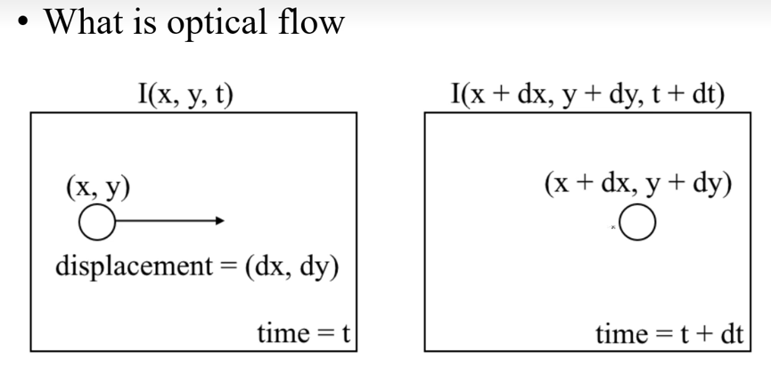
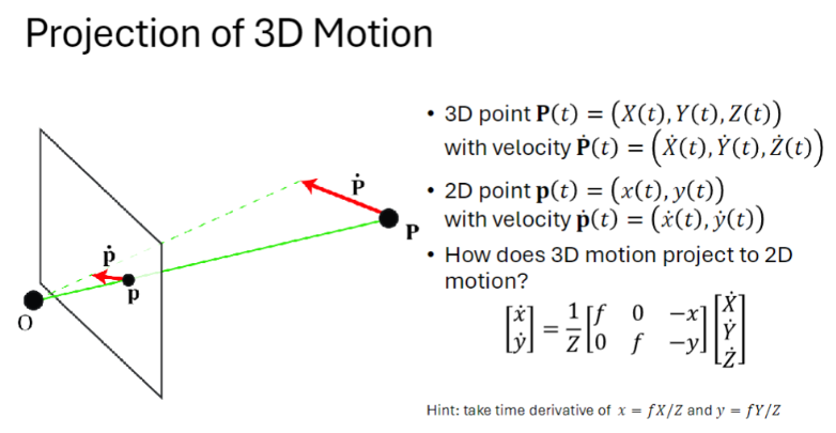
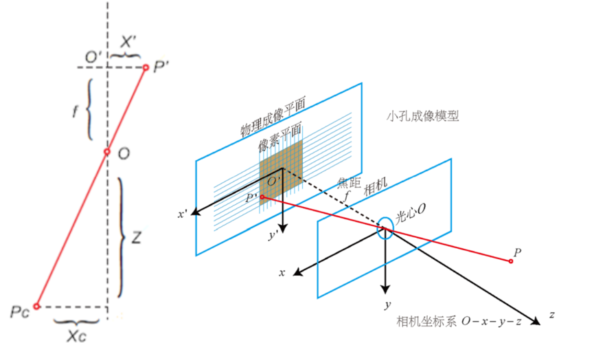

## 🛠️ 内容及总结

### 1. 实时仿地高空视觉算法调研

#### 1.1 调研目标
确定是否能够**仅依靠单 D455 传感器**（不使用气压计、GPS、激光雷达），实现 **100m 高空的实时仿地飞行**，并保持相对地面 **10m 以内**的精度。

#### 1.2 核心结论
通过调研确认：**单 D455 完全可以做到**，但需满足以下前提：
- ✅ 仅使用 **单目 + IMU**，**不使用双目深度**（双目远距离精度过低，仅适合 20m 以内近地场景）。
- ✅ 必须保证无人机 **飞行速度恒定**。

> ⚠️ **为何放弃双目？**  
> D455 双目有效距离仅 0.3~6m（官方标称）。在 100m 处理论视差计算如下：  
> $$d = \frac{f \times B}{Z} = \frac{960 \times 0.095}{100} \approx 0.912 \text{ 像素}$$  
> 视差不足 1 像素，测距误差可达数十米。强行融合双目数据反而会引入大量噪声污染。  
> **因此，D455 在本方案中的定位为：** 内置 IMU、硬件同步、全局快门的 RGB 单目相机（深度模块保留用于低空避障）。

#### 1.3 视觉测距/预测算法对比

| 方法 | 100m 可行性 | 原因 |
| :--- | :---: | :--- |
| 单帧双目立体 | ✗ | 基线太短，视差不可测 |
| 深度学习单目深度 | ✗ | 训练集上限 80m，缺乏无人机视角数据 |
| **光流 + 已知速度测高** | **✓** | 运动产生长基线，核心可行 |
| 单应性分解测高 | ✓ | 多点约束更鲁棒 |
| VIO + 地面点云 | ✓ | 可复用现成框架 |

### 2. 光流法测高原理

**光流**即瞬时速率，在极短时间间隔（如视频连续两帧）内等同于目标点位移。其核心规律为：**光流大小与距离成反比**（光流大 → 距离近；光流小 → 距离远）。

当无人机恒定前飞时，地面纹理在倾斜相机画面中向上移动。已知前飞速度和光流速度，即可通过几何公式算出相对地面高度。**本质是通过“飞行运动产生长基线”。**

#### 2.1 参数定义

| 符号 | 含义 | 来源 |
| :--- | :--- | :--- |
| $H$ | 无人机相对地面的垂直高度 | 待求解 |
| $v$ | 无人机水平前飞速度 | 航线规划设定 |
| $f$ | 相机焦距（像素单位） | D455 内参标定值 |
| $\alpha$ | 相机与机体轴的安装角 | 机械安装固定（预设 45°） |
| $\theta_{imu}$ | 无人机实际俯仰角 | IMU 实时测量 |
| $\theta$ | 相机光轴与水平面实际夹角 | $\theta = \alpha + \theta_{imu}$ |
| $v_p$ | 地面点在图像中的移动速度（px/s） | 光流跟踪测量 |

#### 2.2 坐标变换与投影模型

设世界坐标系 $(X_w, Y_w, Z_w)$，地面点 P 坐标为 $(X, 0, -H)$。  
相机坐标系 $(X_c, Y_c, Z_c)$ 经安装角 $\alpha$ 和俯仰角 $\theta_{imu}$ 旋转后，在简化二维前视平面（X-Z 平面）中：

$$
\begin{cases}
X_c = X_w \\
Y_c = H \cdot \sin(\theta) \\
Z_c = -H \cdot \cos(\theta)
\end{cases}
$$

根据针孔相机模型，三维点投影到图像坐标：

$$
x = f \cdot \frac{X_c}{Z_c}, \quad y = f \cdot \frac{Y_c}{Z_c}
$$

对投影方程求时间导数并换算变形后，得到高度公式：

$$
H = \frac{v \cdot f \cdot \sin(\theta)}{v_p}
$$

其中 $v$、$f$、$\theta$ 基本固定，**高度 $H$ 完全由地面光流速度 $v_p$ 决定**。

#### 2.3 光流测距范围分析

| 高度 | 光流表现 | 测量难度 |
| :--- | :--- | :--- |
| 很低 | 纹理“飞驰”，$v_p$ 极大 | 特征点飞出画面过快，跟踪易失败 |
| 很高 | 纹理“蠕动”，$v_p$ 极小 | 信号微弱，易被噪声淹没 |
| 适中 | 纹理平稳移动 | **最佳工作区，测距精度高** |

以 D455 为例（$f=960$ px, $v=10$ m/s, $\theta≈45°$, 30 FPS）：

- **分子常数**：$v \cdot f \cdot \sin(\theta) ≈ 6787$
- **最低可测距离**：LK 光流可靠跟踪上限约 900~1500 px/s → $H_{min} ≈ 7.5$ m
- **最远可测距离**：信噪比 ≥ 3~5 倍要求 $v_p ≥ 90$ px/s → $H_{max} ≈ 75$ m

> 💡 后续可通过滤波算法进一步抑制噪声，提升最远测量距离。

#### 2.4 光流法局限性及应对

| 局限 | 说明 | 应对策略 |
| :--- | :--- | :--- |
| 必须前飞 | 悬停/掉头时失效 | 结合其他传感器或切换模式 |
| 依赖地面纹理 | 水面、雪地、阴影下退化 | 纹理检测 + 异常剔除 |
| 需 IMU 补偿 | 飞机抖动影响光流计算 | IMU 辅助运动补偿 |
| IMU 俯仰漂移 | 漂 1° 在 100m 高度产生 ~1.7m 误差 | **用地平线视觉俯仰角修正 IMU**，零漂移 |
